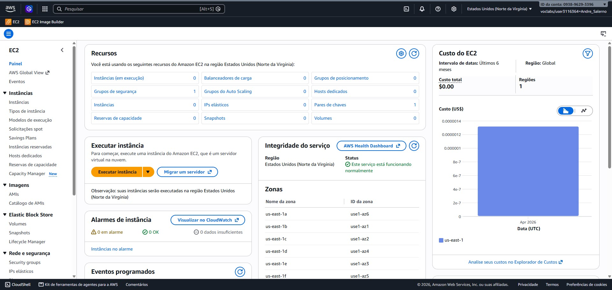
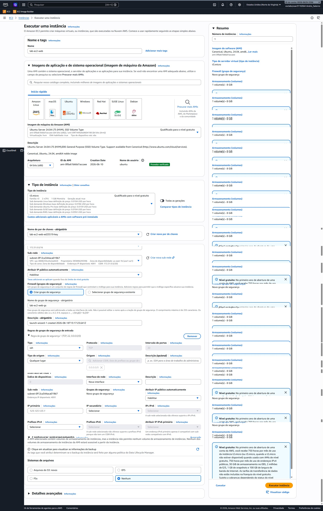
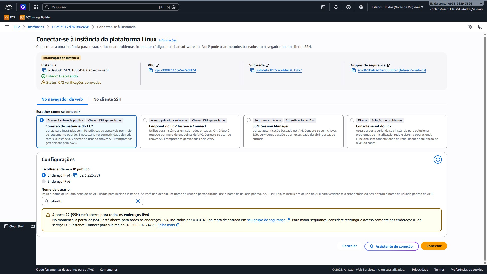
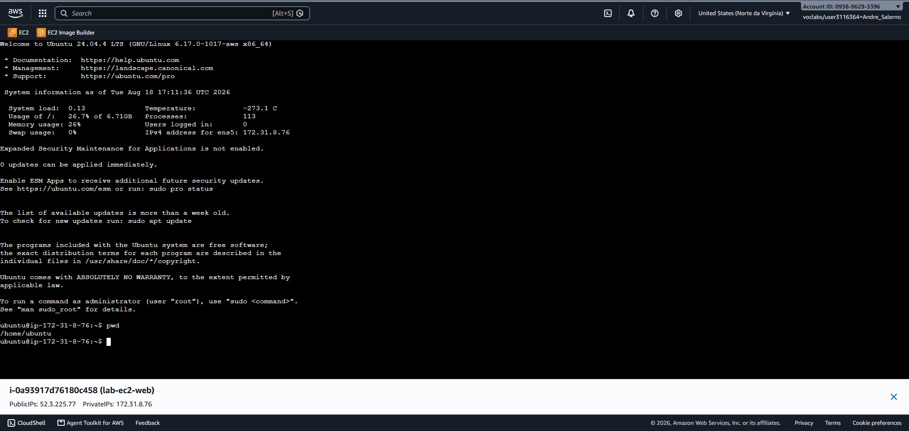
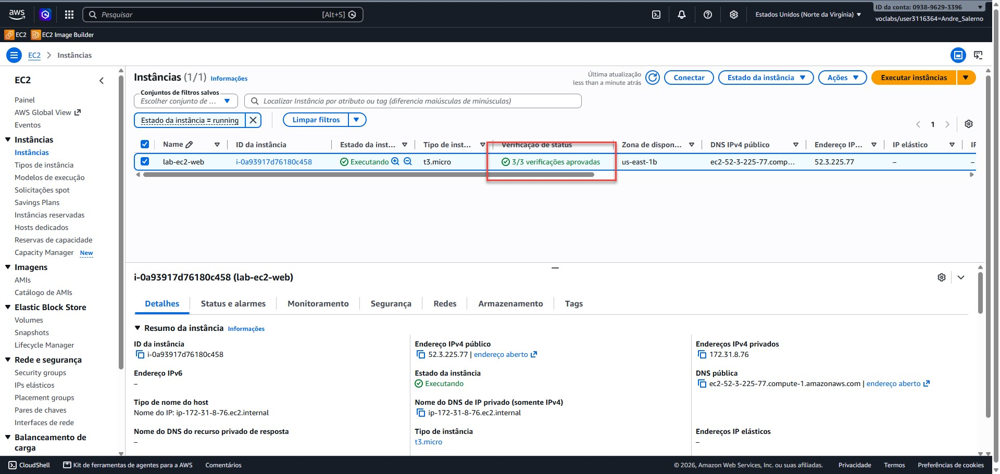
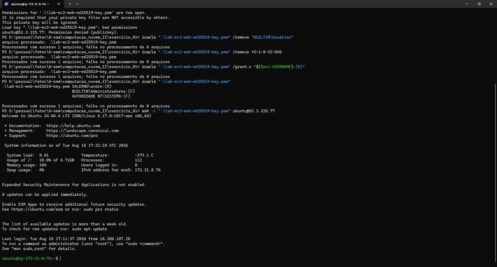
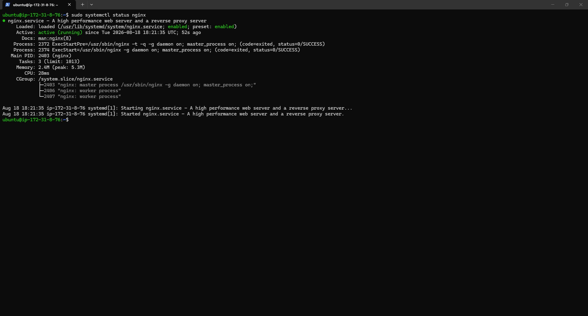
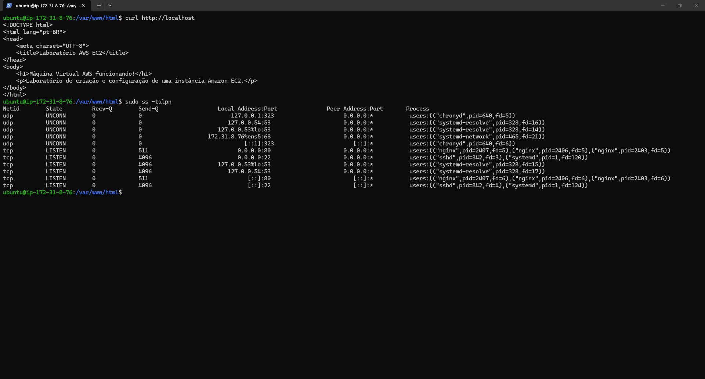
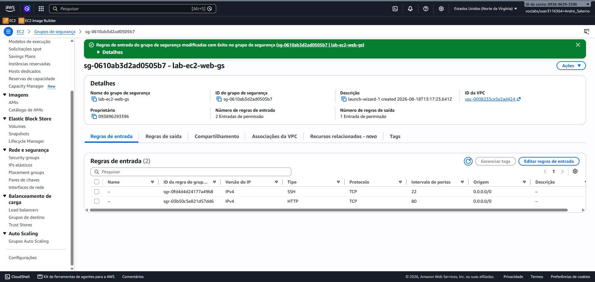
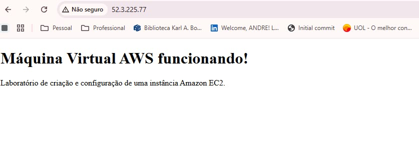

# Relatório de Evidências – Instância AWS EC2

## 1. Objetivo

O objetivo deste laboratório foi criar, configurar e disponibilizar uma máquina virtual utilizando o serviço Amazon Elastic Compute Cloud (Amazon EC2), da Amazon Web Services (AWS), aplicando práticas básicas de segurança, configuração de rede e administração de servidores.

Ao final da atividade, a instância foi disponibilizada para acesso externo por meio de seu endereço IPv4 público, permitindo validar seu correto funcionamento através de uma página web.

Além do provisionamento da máquina, foram consideradas boas práticas durante a instanciação e após a instalação do sistema operacional.

---

## 2. Criação da máquina virtual

Foi criada uma instância no serviço Amazon EC2 utilizando as seguintes configurações:

* **Nome da instância:** lab-ec2-web
* **Sistema operacional:** Ubuntu Server 24.04 LTS
* **Tipo da instância:** t3.micro
* **Armazenamento:** 8 GB ou superior
* **Método de acesso administrativo:** SSH utilizando par de chaves ED25519
* **Serviço disponibilizado:** servidor web Nginx
* **Acesso externo:** IPv4 público
* **Protocolo da aplicação:** HTTP

A escolha de uma instância de pequeno porte é adequada ao objetivo do laboratório, pois os recursos necessários para executar um servidor web simples são reduzidos.

Dessa forma, evita-se o provisionamento excessivo de recursos computacionais para uma aplicação que possui baixa demanda.

> Inserir uma captura da configuração utilizada antes da criação da instância.

1. Painel EC2



**Evidência 2 – Instância em execução**

2. Configuração



3. Conexão



4. Terminal


---

**Evidência 1 – Instância criada**

> Inserir uma captura do Amazon EC2 mostrando a instância com estado `Running` e os status checks aprovados.



5. Conexão local via Powershell




## 3. Escolha do par de chaves SSH

Para realizar o acesso administrativo remoto à máquina virtual foi utilizado um par de chaves do tipo **ED25519**.

A escolha foi feita por se tratar de um algoritmo moderno, seguro e eficiente para autenticação SSH. Em comparação ao RSA, o ED25519 consegue oferecer elevado nível de segurança utilizando chaves menores, além de apresentar bom desempenho nas operações criptográficas de assinatura e validação.

Outro fator considerado foi sua compatibilidade com ambientes Linux e clientes SSH modernos, como o OpenSSH utilizado pelo Ubuntu e pelas ferramentas de acesso remoto disponíveis no Visual Studio Code.

Embora o RSA continue sendo uma alternativa segura quando utilizado com tamanho de chave adequado, sua principal vantagem neste contexto seria a compatibilidade com sistemas mais antigos.

Como este laboratório utiliza um ambiente moderno, composto por Ubuntu, Amazon EC2, Visual Studio Code e OpenSSH, optou-se pelo **ED25519**.

O acesso à instância pode ser realizado utilizando:

```bash
ssh -i "lab-ec2-web-ed25519-key.pem" ubuntu@IP_PUBLICO
```

A chave privada deve ser mantida em local seguro e não deve ser compartilhada ou armazenada em repositórios públicos.

---

## 4. Configurações de rede

Durante a criação da instância EC2, foram definidas as configurações de rede necessárias para garantir conectividade, acesso remoto e disponibilidade do serviço web.

A configuração adotada considerou os seguintes elementos:

* VPC;
* sub-rede;
* zona de disponibilidade;
* atribuição automática de IPv4 público;
* firewall através de Security Group;
* criação de um grupo de segurança específico;
* definição das regras de entrada.

Essas decisões foram tomadas buscando manter a infraestrutura simples e adequada ao objetivo acadêmico do laboratório.

### 4.1 VPC

Foi utilizada a **VPC padrão da AWS**, também chamada de **Default VPC**.

A VPC, ou Virtual Private Cloud, representa uma rede virtual isolada dentro da infraestrutura da AWS. É dentro dela que recursos como instâncias EC2 são executados.

A escolha pela VPC padrão foi realizada porque este laboratório possui uma arquitetura simples, composta por apenas uma máquina virtual e um serviço web.

Não existe, portanto, a necessidade de criar uma VPC personalizada com regras avançadas de roteamento ou segmentação.

A VPC padrão já possui os principais componentes necessários para o funcionamento do laboratório, incluindo:

* espaço de endereçamento privado;
* sub-redes;
* tabela de rotas;
* conexão com Internet Gateway;
* suporte ao uso de endereços IP públicos.

A utilização da VPC padrão simplifica o processo de configuração e reduz a possibilidade de erros durante o laboratório.

Em um ambiente corporativo ou de produção, entretanto, seria recomendável criar uma VPC específica para a aplicação, permitindo maior controle sobre endereçamento, segmentação, segurança e comunicação entre recursos.

### 4.2 Sub-rede

Foi utilizada uma **sub-rede pública pertencente à VPC selecionada**.

Uma sub-rede representa uma subdivisão da VPC e contém uma faixa de endereços IP disponível para os recursos nela instalados.

A escolha por uma sub-rede pública ocorreu porque a máquina virtual precisa possuir conectividade com a Internet.

Isso é necessário para:

* permitir acesso remoto via SSH;
* realizar atualizações do sistema operacional;
* instalar pacotes;
* instalar o servidor web Nginx;
* disponibilizar a página web para acesso externo.

Uma sub-rede pública possui conectividade com um Internet Gateway através da tabela de rotas da VPC.

A arquitetura pode ser representada de forma simplificada como:

```text
Internet
   │
   ▼
Internet Gateway
   │
   ▼
VPC
   │
   ▼
Sub-rede pública
   │
   ▼
Instância EC2
```

Como o objetivo do laboratório é disponibilizar uma máquina acessível pela Internet, a utilização de uma sub-rede pública é adequada.

### 4.3 Zona de Disponibilidade

A instância foi criada em uma **Zona de Disponibilidade da região AWS selecionada**.

Uma Zona de Disponibilidade, ou Availability Zone, representa uma localização física independente dentro de uma região da AWS.

Exemplos:

```text
us-east-1a
us-east-1b
us-east-1c
```

A escolha da Zona de Disponibilidade está diretamente relacionada à sub-rede selecionada, pois cada sub-rede pertence a uma única Zona de Disponibilidade.

Para este laboratório, foi utilizada uma única Zona de Disponibilidade porque existe apenas uma máquina virtual e não há requisito de alta disponibilidade.

Essa decisão mantém a arquitetura simples e suficiente para o objetivo da atividade.

Em uma aplicação de produção, uma boa prática seria distribuir diferentes instâncias entre duas ou mais Zonas de Disponibilidade.

### 4.4 Atribuir IP público automaticamente

A opção:

```text
Auto-assign Public IP
```

foi configurada como:

```text
Enable
```

Essa decisão foi necessária porque um dos requisitos da atividade é fornecer uma **prova final de funcionamento através de um link de acesso externo**.

A instância recebe internamente um endereço IPv4 privado, semelhante a:

```text
172.31.x.x
```

Esse endereço é utilizado para comunicação dentro da VPC e não pode ser utilizado diretamente por computadores localizados na Internet.

Por isso, foi habilitada a atribuição automática de um endereço IPv4 público.

Neste laboratório, o endereço IPv4 público utilizado foi:

```text
52.3.225.77
```

Esse endereço permite tanto o acesso administrativo via SSH quanto o acesso ao servidor web.

Exemplo de acesso SSH:

```bash
ssh -i "lab-ec2-web-ed25519-key.pem" ubuntu@52.3.225.77
```

Exemplo de acesso HTTP:

```text
http://52.3.225.77
```

### 4.5 Firewall – Grupos de Segurança

Na AWS, o controle de tráfego de rede da instância foi realizado através de um **Security Group**, ou Grupo de Segurança.

O Security Group funciona como um firewall virtual associado à instância EC2.

Sua função é definir quais conexões são permitidas para entrar ou sair da máquina.

Durante a configuração da EC2, foi selecionada a opção:

```text
Create security group
```

A criação de um Security Group específico permite definir regras próprias para esta máquina e facilita sua identificação e manutenção.

### 4.6 Nome do Grupo de Segurança

Foi criado um grupo de segurança específico para a máquina.

O nome utilizado foi:

```text
lab-ec2-web-sg
```

O sufixo `sg` representa **Security Group**.

A utilização de nomes descritivos é uma boa prática porque facilita a identificação dos recursos dentro do ambiente AWS.

### 4.7 Regra SSH

Para o acesso administrativo remoto foi utilizada a seguinte regra:

```text
Tipo: SSH
Protocolo: TCP
Porta: 22
Tipo de origem: Qualquer lugar
Origem: 0.0.0.0/0
```

Essa configuração permite que qualquer endereço IPv4 da Internet tente estabelecer uma conexão com a porta 22.

A escolha foi realizada para facilitar o acesso durante o laboratório, principalmente em cenários nos quais o endereço IP da rede local possa variar.

Entretanto, essa não é a configuração recomendada para ambientes permanentes ou de produção.

Uma configuração mais segura seria restringir a origem para:

```text
Meu IP
```

por exemplo:

```text
200.xxx.xxx.xxx/32
```

A autenticação SSH permanece protegida pelo par de chaves ED25519.

### 4.8 Regra HTTP

Para permitir que a página hospedada no Nginx possa ser acessada externamente, foi utilizada:

```text
Tipo: HTTP
Protocolo: TCP
Porta: 80
Tipo de origem: Qualquer lugar
Origem: 0.0.0.0/0
```

Nesse caso, utilizar **Qualquer lugar** é adequado ao objetivo do laboratório, pois a página deverá ser acessível externamente.

---

## 5. Resumo das decisões de rede

| Configuração            | Decisão                | Justificativa                                               |
| ----------------------- | ---------------------- | ----------------------------------------------------------- |
| VPC                     | VPC padrão             | Suficiente para uma arquitetura simples                     |
| Sub-rede                | Pública                | Necessária para conectividade com a Internet                |
| Zona de Disponibilidade | Uma única AZ           | Não há requisito de alta disponibilidade                    |
| IPv4 público automático | Habilitado             | Necessário para SSH e para o link externo                   |
| Firewall                | Security Group         | Controla o tráfego permitido                                |
| Security Group          | Criado especificamente | Facilita organização e controle                             |
| Nome do Security Group  | lab-ec2-web-sg         | Nome descritivo                                             |
| SSH                     | TCP 22                 | Administração remota                                        |
| Origem SSH              | 0.0.0.0/0              | Facilita o laboratório, embora não seja ideal para produção |
| HTTP                    | TCP 80                 | Necessário para o Nginx                                     |
| Origem HTTP             | 0.0.0.0/0              | Permite acesso público                                      |

---

## 6. Conexão com a máquina pelo terminal local

Após a criação da instância e sua entrada no estado `Running`, foi realizada a conexão remota a partir de uma máquina Windows utilizando o PowerShell e o protocolo SSH.

O SSH permite estabelecer uma sessão criptografada entre o computador local e a máquina virtual hospedada na AWS.

Para realizar a conexão foram necessários:

* endereço IPv4 público;
* usuário padrão da imagem Ubuntu;
* chave privada ED25519;
* porta TCP 22 liberada no Security Group.

O diretório local utilizado foi:

```text
D:\pessoal\fatec\6-sem\computacao_nuvem_II\exercicio_01
```

O arquivo da chave privada foi:

```text
lab-ec2-web-ed25519-key.pem
```

O endereço público da instância foi:

```text
52.3.225.77
```

O comando utilizado foi:

```powershell
ssh -i "lab-ec2-web-ed25519-key.pem" ubuntu@52.3.225.77
```

### 6.1 Erro de permissões da chave privada

Após a validação do host, a conexão não foi concluída porque o OpenSSH identificou que o arquivo da chave privada possuía permissões excessivamente abertas.

Foi apresentado:

```text
WARNING: UNPROTECTED PRIVATE KEY FILE!

Permissions for 'lab-ec2-web-ed25519-key.pem' are too open.
It is required that your private key files are NOT accessible by others.
This private key will be ignored.
```

Como consequência, a chave foi ignorada e a autenticação retornou:

```text
Permission denied (publickey).
```

Esse comportamento é uma medida de segurança do OpenSSH.

Uma chave privada representa uma credencial de autenticação e, portanto, não deve ser legível por outros usuários do computador.

### 6.2 Verificação das permissões no Windows

No Windows, as permissões do arquivo podem ser consultadas através do comando:

```powershell
icacls ".\lab-ec2-web-ed25519-key.pem"
```

Inicialmente, o arquivo apresentava permissões destinadas a grupos amplos de usuários.

Uma das permissões identificadas foi:

```text
AUTORIDADE NT\Usuários autenticados
```

Para impedir a herança automática de permissões do diretório, foi executado:

```powershell
icacls ".\lab-ec2-web-ed25519-key.pem" /inheritance:r
```

O comando remove a herança das ACLs provenientes do diretório pai.

Em seguida, foi removida a permissão do grupo de usuários autenticados:

```powershell
icacls ".\lab-ec2-web-ed25519-key.pem" /remove "Usuários autenticados"
```

Também foi utilizado o identificador SID correspondente:

```powershell
icacls ".\lab-ec2-web-ed25519-key.pem" /remove *S-1-5-11
```

Após essa alteração, as permissões foram novamente consultadas:

```powershell
icacls ".\lab-ec2-web-ed25519-key.pem"
```

O resultado apresentou:

```text
BUILTIN\Administradores:(F)
AUTORIDADE NT\SISTEMA:(F)
BUILTIN\Usuários:(RX)
```

### 6.3 Segundo diagnóstico das permissões

Ao tentar novamente a conexão:

```powershell
ssh -i ".\lab-ec2-web-ed25519-key.pem" ubuntu@52.3.225.77
```

o OpenSSH identificou que o grupo:

```text
BUILTIN\Usuários
```

ainda possuía permissão de leitura e execução sobre a chave.

O erro apresentado foi:

```text
Bad permissions. Try removing permissions for user:
BUILTIN\Usuários (S-1-5-32-545)
```

Isso confirmou que a chave ainda estava acessível por usuários além do proprietário.

Para corrigir essa situação, a permissão desse grupo deve ser removida:

```powershell
icacls ".\lab-ec2-web-ed25519-key.pem" /remove "BUILTIN\Usuários"
```

Caso seja necessário utilizar diretamente o SID do grupo:

```powershell
icacls ".\lab-ec2-web-ed25519-key.pem" /remove *S-1-5-32-545
```

Depois, deve ser concedida explicitamente permissão de leitura ao usuário responsável pelo laboratório:

```powershell
icacls ".\lab-ec2-web-ed25519-key.pem" /grant:r "$($env:USERNAME):(R)"
```

Uma alternativa mais explícita, incluindo domínio ou nome do computador, é:

```powershell
icacls ".\lab-ec2-web-ed25519-key.pem" /grant:r "$($env:USERDOMAIN)\$($env:USERNAME):(R)"
```

Após as alterações, as permissões podem ser verificadas novamente:

```powershell
icacls ".\lab-ec2-web-ed25519-key.pem"
```

O objetivo é que grupos amplos, como:

```text
BUILTIN\Usuários
Usuários autenticados
Everyone
```

não tenham permissão de leitura sobre a chave privada.

### 6.4 Relação com sistemas Linux

O controle realizado através do `icacls` no Windows possui finalidade semelhante ao comando utilizado em sistemas Linux:

```bash
chmod 400 chave.pem
```

O objetivo em ambos os casos é garantir que somente o proprietário autorizado consiga acessar a chave privada.

Essa etapa representa uma importante boa prática de segurança, pois impede que outras contas presentes no mesmo computador utilizem a credencial para tentar acessar a instância.

### 6.5 Nova tentativa de conexão

Depois da correção das permissões, a conexão deve ser realizada novamente:

```powershell
ssh -i ".\lab-ec2-web-ed25519-key.pem" ubuntu@52.3.225.77
```

Quando a autenticação for concluída corretamente, o terminal deverá apresentar um prompt semelhante a:

```text
ubuntu@ip-172-31-x-x:~$
```

A partir desse momento, os comandos digitados no terminal estarão sendo executados diretamente na instância EC2.

### 6.6 Validação do acesso remoto

Após entrar na máquina, podem ser utilizados os seguintes comandos para comprovar a conexão:

```bash
whoami
```

Resultado esperado:

```text
ubuntu
```

Também pode ser utilizado:

```bash
hostname
```

para visualizar o nome interno da instância.

Outro comando útil é:

```bash
cat /etc/os-release
```

que exibe informações sobre a distribuição Linux instalada.

### 6.7 Aprendizados relacionados ao problema de conexão

Os erros encontrados durante a conexão permitiram identificar diferentes etapas do processo SSH.

O primeiro erro:

```text
Connection timed out
```

estava relacionado à conectividade com o endereço informado.

Após utilizar o IPv4 correto, o servidor passou a responder e apresentou a verificação da host key.

Posteriormente, o erro:

```text
UNPROTECTED PRIVATE KEY FILE
```

demonstrou que a comunicação com a EC2 estava funcionando, mas a chave privada local não atendia aos requisitos de segurança do cliente OpenSSH.

Por fim, a utilização do `icacls` permitiu ajustar as permissões do arquivo de forma que somente usuários autorizados pudessem acessá-lo.

O processo demonstrou que uma conexão SSH depende de diferentes elementos:

1. conectividade de rede;
2. endereço IP correto;
3. porta 22 disponível;
4. identificação do servidor;
5. chave privada correspondente;
6. permissões adequadas sobre a chave;
7. usuário correto da máquina remota.

---

## 7. Representação da arquitetura de rede

A estrutura criada pode ser representada como:

```text
                          INTERNET
                             │
                      Internet Gateway
                             │
                    ┌────────▼────────┐
                    │      VPC        │
                    │                 │
                    │   Sub-rede      │
                    │    pública      │
                    │                 │
                    │     EC2         │
                    │ Ubuntu + Nginx  │
                    └────────┬────────┘
                             │
                    Security Group
                             │
                 ┌───────────┴───────────┐
                 │                       │
                 ▼                       ▼
             TCP 22                  TCP 80
               SSH                    HTTP
                 │                       │
            0.0.0.0/0               0.0.0.0/0
                 │                       │
          Acesso remoto             Página pública
```

---

## 8. Atualização do sistema operacional

Após o primeiro acesso, foram atualizados os repositórios e pacotes do sistema operacional.

Foram utilizados:

```bash
sudo apt update
sudo apt upgrade -y
```

Essa etapa é importante como boa prática pós-instalação, pois permite aplicar atualizações e correções disponibilizadas para o sistema operacional.

A versão instalada pode ser consultada utilizando:

```bash
cat /etc/os-release
```

---

## 9. Instalação do servidor web

Para comprovar o funcionamento da máquina, foi instalado o Nginx:

```bash
sudo apt install nginx -y
```

Após a instalação, o serviço foi validado utilizando:

```bash
sudo systemctl status nginx
```

O resultado esperado é:

```text
active (running)
```

Também foi configurada a inicialização automática:

```bash
sudo systemctl enable nginx
```

Dessa forma, o Nginx será iniciado automaticamente caso a máquina seja reiniciada.

**Evidência – Serviço Nginx**

> Inserir captura demonstrando o Nginx com estado `active (running)`.



---

## 10. Criação da página de validação

A página padrão do Nginx pode ser substituída por uma página personalizada.

O arquivo utilizado é:

```text
/var/www/html/index.html
```

Exemplo:

```html
<!DOCTYPE html>
<html lang="pt-BR">
<head>
    <meta charset="UTF-8">
    <title>Laboratório AWS EC2</title>
</head>
<body>
    <h1>Máquina Virtual AWS funcionando!</h1>
    <p>Laboratório de criação e configuração de uma instância Amazon EC2.</p>
</body>
</html>
```

Essa página permite comprovar visualmente o funcionamento da infraestrutura criada.

---

## 11. Validação local

O Nginx pode ser testado diretamente na instância utilizando:

```bash
curl http://localhost
```

Caso o serviço esteja funcionando, o HTML da página será retornado.

Também pode ser verificada a porta utilizada:

```bash
sudo ss -tulpn
```





---

## 12. Validação externa

Após a configuração do servidor, o acesso externo deve ser realizado utilizando:

```text
http://52.3.225.77
```



Se a página for exibida corretamente, fica comprovado que:

* a instância está ativa;
* a rede está funcionando;
* existe conectividade com a Internet;
* o IPv4 público foi configurado;
* o Security Group está permitindo HTTP;
* o Nginx está funcionando;
* a página pode ser acessada externamente.

**Evidência – Acesso externo**

> Inserir captura do navegador acessando o endereço público da máquina.

---

## 13. Boas práticas aplicadas

Entre as boas práticas consideradas estão:

* utilização de uma instância compatível com a carga;
* sistema operacional LTS;
* autenticação SSH com chave ED25519;
* proteção das permissões do arquivo da chave privada;
* utilização de Security Group específico;
* documentação das regras de firewall;
* exposição somente dos serviços necessários;
* atualização do sistema operacional;
* inicialização automática do servidor web;
* utilização de nomes descritivos para os recursos;
* armazenamento seguro da chave privada.

A identificação e correção das permissões da chave privada durante o laboratório também demonstrou uma prática importante de segurança: credenciais sensíveis não devem estar acessíveis a usuários não autorizados.

No caso específico do SSH, foi utilizada origem **Qualquer lugar** devido ao caráter temporário e acadêmico do laboratório.

Entretanto, a melhor prática para ambientes permanentes é limitar a origem para endereços IP conhecidos.

---

## 14. Melhorias para ambiente de produção

Em um ambiente de produção, seriam recomendadas medidas adicionais, entre elas:

* alterar a regra SSH de `0.0.0.0/0` para um endereço IP autorizado;
* utilizar HTTPS;
* utilizar certificado TLS;
* utilizar domínio;
* considerar Elastic IP;
* utilizar monitoramento com CloudWatch;
* configurar alertas;
* realizar backups;
* utilizar snapshots;
* revisar periodicamente os Security Groups;
* utilizar IAM com menor privilégio;
* separar recursos entre sub-redes públicas e privadas;
* distribuir serviços entre diferentes Zonas de Disponibilidade;
* utilizar Terraform para automatizar o provisionamento;
* armazenar chaves privadas em diretórios protegidos;
* revisar periodicamente as permissões de arquivos que armazenam credenciais.

---

## 15. Evidências do laboratório

As evidências recomendadas para o relatório são:

1. tela de criação da instância;
2. seleção da VPC;
3. seleção da sub-rede;
4. identificação da Zona de Disponibilidade;
5. opção de atribuição automática de IPv4 público habilitada;
6. criação do Security Group;
7. nome do Security Group;
8. regra SSH TCP 22 com origem `0.0.0.0/0`;
9. regra HTTP TCP 80 com origem `0.0.0.0/0`;
10. instância com estado `Running`;
11. endereço IPv4 público `52.3.225.77`;
12. primeira tentativa de conexão SSH;
13. confirmação da host key ED25519;
14. erro `UNPROTECTED PRIVATE KEY FILE`;
15. consulta das permissões utilizando `icacls`;
16. remoção das permissões de grupos de usuários;
17. nova consulta das permissões;
18. conexão SSH realizada com sucesso;
19. comandos `whoami` e `hostname`;
20. atualização do Ubuntu;
21. instalação e execução do Nginx;
22. navegador acessando a página através do IPv4 público.

---

## 16. Prova final de entrega

A prova final do funcionamento da máquina consiste no acesso externo ao servidor web.

**Link externo:**

```text
http://52.3.225.77
```

Ao acessar esse endereço, deverá ser apresentada a mensagem:

```text
Máquina Virtual AWS funcionando!
```

Isso permite comprovar que a infraestrutura provisionada está funcionando corretamente.

---

## 17. Estimativa de custos e aplicação de conceitos FinOps

Além dos aspectos técnicos relacionados ao provisionamento da máquina virtual, também foi realizada uma análise básica de custos utilizando conceitos de **FinOps – Cloud Financial Operations**.

FinOps pode ser entendido como uma abordagem de gestão financeira aplicada à computação em nuvem, buscando equilibrar custo, desempenho e valor entregue pelos recursos utilizados.

Em ambientes de nuvem, a utilização de recursos possui impacto financeiro direto. Dessa forma, a escolha de uma instância não deve considerar apenas sua capacidade computacional, mas também fatores como:

* tempo em que permanecerá ligada;
* capacidade realmente necessária;
* armazenamento provisionado;
* utilização de endereços IP públicos;
* tráfego de rede;
* recursos ociosos;
* serviços adicionais;
* possibilidade de desligamento após o uso.

Para este laboratório, foi escolhida uma instância `t3.micro`, considerada suficiente para executar um sistema Ubuntu e um servidor Nginx simples.

### 17.1 Custo da instância EC2

Na região `us-east-1`, considerando o modelo de contratação **On-Demand**, uma instância Linux `t3.micro` possui preço aproximado de:

```text
US$ 0,0104 por hora
```

Considerando que a instância permanecesse ligada durante 24 horas por dia durante um mês de aproximadamente 730 horas:

```text
730 × US$ 0,0104
```

o custo aproximado seria:

```text
US$ 7,59 por mês
```

Esse cálculo representa apenas o custo computacional da instância EC2.

A escolha pelo modelo On-Demand é adequada ao laboratório porque não exige compromisso antecipado e permite pagar somente pelo período em que o recurso permanecer em utilização.

Para uma atividade temporária, não existe justificativa para assumir compromissos de longo prazo, como Reserved Instances ou Savings Plans.

### 17.2 Custo de armazenamento

A instância utiliza um volume Amazon EBS para armazenar o sistema operacional e os arquivos da aplicação.

Considerando um volume SSD do tipo `gp3` com 8 GB e um preço de referência aproximado de:

```text
US$ 0,08 por GB/mês
```

o custo estimado seria:

```text
8 GB × US$ 0,08
```

resultando em aproximadamente:

```text
US$ 0,64 por mês
```

A escolha de somente 8 GB de armazenamento também está relacionada ao conceito de **right-sizing**, pois não existe necessidade de provisionar um volume muito maior para uma aplicação de laboratório composta basicamente pelo Ubuntu e pelo Nginx.

Provisionar armazenamento superior à necessidade real aumentaria o custo sem trazer benefício para a atividade.

### 17.3 Custo do endereço IPv4 público

Para que a instância possa ser acessada diretamente pela Internet, foi atribuído um endereço IPv4 público.

A AWS possui cobrança pelo uso de endereços IPv4 públicos.

Considerando o valor aproximado de:

```text
US$ 0,005 por hora
```

e uma utilização durante 730 horas mensais:

```text
730 × US$ 0,005
```

o custo aproximado seria:

```text
US$ 3,65 por mês
```

Esse valor é relevante na análise FinOps porque demonstra que até mesmo recursos aparentemente simples, como um endereço IPv4 público, podem gerar custos quando permanecem provisionados continuamente.

### 17.4 Estimativa mensal básica

Considerando a instância ligada continuamente durante aproximadamente 730 horas, a estimativa seria:

| Recurso              | Estimativa mensal |
| -------------------- | ----------------: |
| EC2 `t3.micro`       |          US$ 7,59 |
| EBS `gp3` – 8 GB     |          US$ 0,64 |
| IPv4 público         |          US$ 3,65 |
| **Total aproximado** | **US$ 11,88/mês** |

Esse valor representa uma estimativa básica e não inclui possíveis custos adicionais relacionados a:

* transferência de dados para a Internet;
* snapshots;
* backups;
* serviços de monitoramento adicionais;
* utilização prolongada de CPU acima da capacidade de baseline;
* criação de outros recursos AWS;
* impostos ou variações comerciais aplicáveis à conta.

### 17.5 Custo proporcional ao período do laboratório

Como a atividade é temporária, manter a instância ligada durante um mês inteiro não seria necessário.

Por exemplo, considerando aproximadamente 10 horas de utilização:

```text
EC2:
10 × US$ 0,0104 = US$ 0,104
```

E considerando também o IPv4 público durante essas mesmas 10 horas:

```text
IPv4:
10 × US$ 0,005 = US$ 0,05
```

O custo computacional e de IPv4 seria, portanto, bastante reduzido quando comparado a manter a infraestrutura ligada continuamente.

Esse comportamento demonstra uma das principais vantagens financeiras da computação em nuvem: recursos podem ser provisionados quando necessários e removidos posteriormente.

### 17.6 Free Tier e créditos promocionais

Dependendo da data de criação e das condições da conta AWS utilizada, parte ou a totalidade do laboratório pode ser coberta pelo programa AWS Free Tier ou por créditos promocionais.

Para contas AWS criadas em ou após 15 de julho de 2025, a AWS passou a disponibilizar um modelo baseado em créditos, podendo fornecer créditos iniciais e adicionais para experimentação de serviços durante um período limitado.

Portanto, o custo efetivamente cobrado na conta pode ser inferior à estimativa apresentada ou até mesmo ser integralmente absorvido pelos créditos disponíveis.

Entretanto, do ponto de vista FinOps, é importante realizar a estimativa utilizando os valores normais dos serviços, pois os créditos são temporários e não devem ser considerados como custo permanente da infraestrutura.

### 17.7 Right-sizing

Um dos princípios aplicados no laboratório foi o **right-sizing**, ou dimensionamento adequado dos recursos.

A instância `t3.micro` possui recursos suficientes para:

* executar Ubuntu Server;
* permitir acesso SSH;
* executar Nginx;
* hospedar uma página HTML simples;
* realizar atualizações do sistema.

Portanto, utilizar uma máquina maior, como `t3.large` ou `t3.xlarge`, representaria superdimensionamento para essa atividade.

O superdimensionamento gera desperdício financeiro porque a cobrança ocorre sobre a capacidade provisionada, mesmo que essa capacidade permaneça ociosa.

A escolha da `t3.micro` busca, portanto, utilizar a menor infraestrutura capaz de atender adequadamente ao requisito.

### 17.8 Instâncias burstable e créditos de CPU

As instâncias da família T3 possuem comportamento do tipo **burstable**.

Isso significa que são projetadas para cargas que normalmente utilizam pouco processamento, mas eventualmente precisam utilizar uma quantidade maior de CPU.

Esse perfil é adequado ao laboratório, pois o servidor Nginx ficará grande parte do tempo com baixa utilização.

Entretanto, instâncias T3 operando em modo Unlimited podem gerar cobrança adicional caso a utilização de CPU permaneça acima do nível baseline por períodos prolongados.

Por isso, em uma aplicação real, uma prática FinOps seria monitorar métricas de CPU e verificar se a família T3 continua sendo economicamente adequada para o padrão de utilização observado.

### 17.9 Recursos ociosos

Um dos principais desperdícios financeiros em ambientes de nuvem ocorre quando recursos permanecem ativos sem necessidade.

Após a conclusão do laboratório, não existe justificativa técnica para manter a máquina EC2 permanentemente ligada.

Uma prática FinOps seria:

```text
Realizar laboratório
        ↓
Validar funcionamento
        ↓
Coletar evidências
        ↓
Realizar avaliação
        ↓
Remover os recursos desnecessários
```

Caso a instância não seja mais necessária, ela pode ser encerrada.

É importante observar que apenas parar uma instância não necessariamente elimina todos os custos, pois recursos associados, como armazenamento EBS e determinados endereços IP, podem continuar gerando cobrança.

Por isso, ao finalizar definitivamente o laboratório, deve-se avaliar a remoção completa dos recursos que não serão mais utilizados.

### 17.10 Monitoramento financeiro

Outra prática FinOps recomendada é acompanhar os custos através das ferramentas de faturamento da AWS.

Podem ser utilizados recursos como:

* AWS Billing;
* AWS Cost Explorer;
* AWS Budgets;
* alertas de orçamento;
* relatórios de custo e utilização.

Para uma conta acadêmica ou de laboratório, pode ser criado um orçamento pequeno com alertas, por exemplo:

```text
Budget mensal: US$ 5,00
```

com notificações quando o consumo atingir determinados percentuais.

Por exemplo:

```text
50% → US$ 2,50
80% → US$ 4,00
100% → US$ 5,00
```

Esse tipo de monitoramento reduz o risco de manter acidentalmente recursos ativos e receber cobranças inesperadas.

### 17.11 Tags para gestão de custos

Também é recomendável utilizar **tags** para identificar os recursos provisionados.

Por exemplo:

```text
Name = lab-ec2-web
Project = computacao-nuvem-II
Environment = laboratorio
Owner = aluno
```

As tags ajudam a identificar a finalidade dos recursos e podem ser utilizadas para análise e alocação de custos.

Em empresas que possuem centenas ou milhares de recursos AWS, essa organização é fundamental para entender quais equipes, sistemas ou projetos são responsáveis pelos gastos.

### 17.12 Síntese da análise FinOps

As principais decisões relacionadas a FinOps neste laboratório foram:

| Prática                | Aplicação no laboratório                      |
| ---------------------- | --------------------------------------------- |
| Right-sizing           | Utilização de uma `t3.micro`                  |
| Pay-as-you-go          | Utilização do modelo On-Demand                |
| Armazenamento adequado | Volume EBS pequeno                            |
| Monitoramento          | Acompanhamento dos custos AWS                 |
| Controle de IP público | Utilização somente quando necessária          |
| Recursos temporários   | Encerramento após o laboratório               |
| Tags                   | Identificação dos recursos                    |
| Controle orçamentário  | Possibilidade de criação de AWS Budget        |
| Free Tier              | Aproveitamento de créditos quando disponíveis |
| Evitar desperdício     | Não manter recursos ociosos                   |

Portanto, sob a perspectiva de FinOps, a infraestrutura escolhida atende ao requisito técnico utilizando recursos pequenos e de baixo custo.

A estimativa de aproximadamente **US$ 11,88 mensais** representa o cenário em que a máquina permanece ligada continuamente durante todo o mês. Como o laboratório possui duração limitada, o custo real tende a ser significativamente menor caso os recursos sejam encerrados após sua utilização.

Essa análise demonstra que boas práticas de computação em nuvem também envolvem decisões financeiras, buscando entregar o resultado necessário com a menor quantidade possível de recursos e evitando desperdícios.


## 18. Conclusão

O laboratório permitiu realizar o processo completo de criação, configuração e disponibilização de uma máquina virtual utilizando o Amazon EC2.

Durante o provisionamento foram tomadas decisões relacionadas a processamento, autenticação, rede e segurança.

Foi utilizada a VPC padrão da AWS por ser adequada a uma arquitetura simples. A instância foi inserida em uma sub-rede pública e em uma única Zona de Disponibilidade, uma vez que o laboratório não possui requisitos de alta disponibilidade.

A atribuição automática de IPv4 público foi habilitada devido à necessidade de realizar acesso remoto e disponibilizar um link externo para comprovação do funcionamento.

Foi criado um Security Group específico denominado `lab-ec2-web-sg`, permitindo documentar e controlar as conexões destinadas à máquina.

A porta 22/TCP foi configurada para SSH com origem `0.0.0.0/0`, correspondente à opção **Qualquer lugar**. Essa decisão facilita o acesso durante a execução do laboratório, embora aumente a exposição da porta SSH. Em um ambiente de produção, a origem deveria ser restrita para endereços confiáveis.

Durante o processo de conexão pelo terminal local, também foram observados aspectos importantes relacionados à segurança do SSH. Primeiramente, foi necessário utilizar o endereço IPv4 público correto da instância. Em seguida, o cliente OpenSSH realizou a validação da host key do servidor e registrou sua impressão digital no arquivo de hosts conhecidos.

Posteriormente, o OpenSSH identificou que a chave privada apresentava permissões excessivamente abertas no sistema Windows. Por segurança, o cliente recusou sua utilização até que as permissões fossem ajustadas.

A ferramenta `icacls` foi utilizada para remover permissões de grupos de usuários que não deveriam ter acesso à chave privada e restringir o acesso ao usuário responsável pelo laboratório.

Essa etapa demonstrou que a segurança do ambiente não depende apenas das configurações realizadas na AWS, mas também da proteção adequada das credenciais armazenadas na máquina local.

Após a correção das permissões, o acesso SSH pôde ser realizado utilizando o usuário `ubuntu`, a chave ED25519 e o IPv4 público da instância.

Por fim, a instalação do Nginx e o acesso ao servidor através do IPv4 público permitiram validar simultaneamente o funcionamento da máquina virtual, do sistema operacional, da rede, do firewall e do serviço web.

Dessa forma, a atividade demonstrou conceitos fundamentais de provisionamento, conectividade, autenticação, administração remota e segurança de infraestrutura em nuvem.
